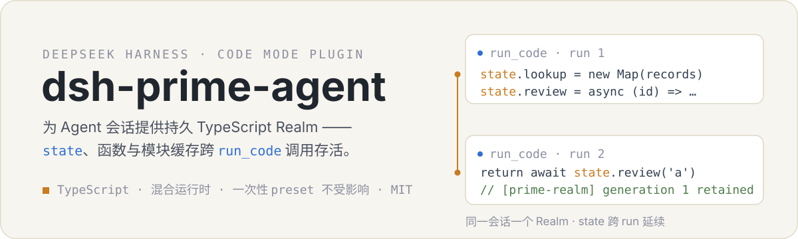
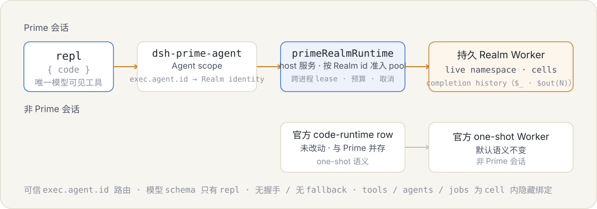

<p align="center">
  
</p>

<p align="center">
  <a href="docs/architecture.md">当前架构</a> ·
  <a href="docs/prime-agent-learnings.md">Prime Agent 学习笔记</a> ·
  <a href="docs/upstream-sync.zh.md">上游同步手册</a>
</p>

`dsh-prime-agent` 是面向 DeepSeek Harness 的 RLM-first 控制面。选中 Prime preset 的会话只有一个模型可见工具 `repl`：它的唯一参数是 `{ code }`，执行一个持久 TypeScript REPL cell。上一 cell 声明的普通变量、函数和对象，下一 cell 可以直接使用；DSH 的其他工具不进入模型 schema，而是作为 `tools`、`agents`、`jobs` 绑定预加载进 cell。

```ts
// 第 1 次 repl
repl({ code: `
const lookup = new Map(records.map(item => [item.id, item]))
const review = async (id) => tools.review_item({ item: lookup.get(id) })
lookup.size
` })

// 第 2 次 repl —— 同一会话的新调用
repl({ code: `await review('a') // Map 和函数都还活着` })
```

普通会话完全不受影响,继续使用官方 one-shot 语义。

## 工作原理

<p align="center">
  
</p>

- 模型 catalog 只含 `repl`。其他 DSH 工具不直接可见：prompt assembly 把 tools 列表过滤到只剩 `repl`，并移除固定 Harness identity 与隐藏能力各自的 `tool:*` 独立提示；前者不提供操作事实，后者按外层直接工具编写，会与 Prime 路由冲突。生成 SDK 的 declaration/JSDoc 是 cell 内能力的唯一使用契约。直接调用其他工具会被 guard 拒绝，这些能力作为 cell 内预加载绑定出现；Prime preset 通过 `prime-tool-restrictions.config.deny` 明确排除重复的 `str_replace_editor`、通用 `workflow` 和 `ralph`，通用 scoped 插件仅应用该配置；保留 `read`/`write`/`edit`/`apply_patch` 及其他所需能力。`tools.*` 调用向 Realm 程序返回 canonical value；若对象结果未经转换直接成为 cell completion，则使用 DSH 官方 `result.content` 展示，避免把 `edit.before/after` 等大 DTO 展开进上下文。`agents.*`（spawn/fork/list/send/interrupt）与 `jobs.*`（list/output/kill）是 continuable child 与后台任务的薄适配。Agent 固定提示与具体对话、任务、仓库和历史错误无关。
- 路由信任 Agent 执行上下文。`repl` 要求拥有 Agent 会话:插件用可信 `exec.agent.id` 从共享 `realm-identity` 存储解析该会话稳定的不透明 Realm id,再把程序、本轮租约绑定与取消信号交给 host 侧的 `ctx.primeRealmRuntime.run(...)`。没有握手、没有模型可见的身份工具;缺少可信执行上下文或无法解析 Realm id 时明确失败,绝不降级。
- Host 服务与官方运行时并存。`cordis.patch.yml` 只是把 `dsh-prime-agent/runtime` 作为新 row 插入,官方 `code-runtime` row 原样保留;非 Prime 会话继续使用官方 one-shot 语义,不存在 fallback。
- Realm 内的绑定经跨 run 稳定的 Proxy 与 per-run binding lease 调用:schema、审批、沙箱、日志、并发和取消仍由 DSH 执行,run 结束立即撤销授权。
- 多个 TUI 进程可共享 Prime 持久状态并同时运行不同 Session；同一 Session 的 live Realm 同时只允许一个进程持有，owner 退出后另一进程以空 namespace 接管。
- Prime 不封装搜索 provider：`tools.grep` 仍调用 DSH 正式 `grep`。提示词组装按工具名复制 schema，在 `edit`、`grep`、`write` 的原始 description 后只追加各自缺失的关键约束；`grep` 说明普通文本使用字符串，正则语法使用无 flags literal 的 `.source`（例如 `pattern: /stream\(options\)/.source`），并要求 parse error 后修正再重试。生成 SDK 与 Realm interface 都保持 DSH canonical `pattern: string`，不扩展公开类型，也不修改 catalog 中共享定义；Host binding seam 只接收 lossless JSON。
- Prime 额外注册本地组合能力 `tools.apply_patch({ patch })`：对齐 OpenAI Codex `apply_patch` 的 marker/heredoc parser、顺序 hunk、EOF/纯追加和 exact → rstrip → trim → Unicode 归一化匹配语义，并一次预检同文件多 hunk 或多文件 Add/Update；Add 与 Codex 一样允许覆盖已有目标。相对或绝对目标路径原样交给 Agent catalog 中正式的 DSH `read`/`write` nested calls，路径解析与授权、sandbox、approval、observation、日志、取消和单文件原子发布仍由 DSH 拥有。每个 REPL nested call 按官方 `tool/code-dispatch-start` / `tool/code-dispatch` 协议记录，因此官方 Web 与兼容 TUI 都能递归显示；`apply_patch` 投影标准 `card: 'diff'`，失败结果走 generic error fallback。`edit` 继续用于一次精确的原位替换；`apply_patch` 负责相关的多 hunk/多文件变更，两者不互相替代。
- Profile 显式安装的 DSH Host MCP client 把 server tools 注册进统一 catalog，repl 单元自动获得对应 `tools.*` 绑定；Prime 不复制 Python kernel-owned MCP runtime。
- Prime preset 挂载 DSH 官方持久 Terminal：POSIX 使用 Bash，Windows 使用 PowerShell；`terminal_open`/`terminal_send`/`terminal_read`/`terminal_signal`/`terminal_close`/`terminal_list` 通过 `tools.*` 调用。同行安装的 `dsh-tool-monitor` 可对后台 `terminal_send` 产生的 `pty-send-*` Job 做逐行 JavaScript 正则订阅。
- `tools.*` 返回值始终遵循 canonical `ToolOutputMap`，可直接访问 `read.lines`、`edit.before/after` 等字段；对象结果直接成为 completion 时只改变模型展示为官方 content，不改变程序拿到的值。不要对返回值盲目再次 `JSON.parse`。notebook 结构化 preview 中的 `\\` 只是 JSON notation；模型自行编写 Windows 路径时优先使用 `D:/work/project` 形式，避免额外转义层。工具参数使用 TypeScript 对象字面量；完整 cell 会在执行前解析，语法失败不会执行其中任何代码或 tool call，修正后应重试。
- Prime preset 为模型可见的工具结果配置 12KB best-effort spill 阈值；`repl` 的外层 canonical value 仍是可程序化读取的 lossless JSON（`logs`、可选 `result` 与可信 presentation metadata），但模型只看到无类型外壳的 notebook 文本：logs 和字符串原样显示，结构化值只 pretty-print 一次，空结果返回空文本；renderer 不添加 `[repl result: ...]`、`[repl logs]` 或 Markdown fence。普通程序异常只保留可行动的异常消息，不把 Worker/V8 内部调用栈带进模型或界面。外层 notebook 文本超过展示预算时由 DSH 写入 artifact 并返回 locator；保存失败时保留完整 inline 成功结果并告警，不伪造 locator。
- 完成值由 runtime 自动保留在 generation-local 的 completion history 中：`$_` 是最近已保留结果的首选入口，`$out(N)` 只用于较早结果；runtime-authored preview 由 nonce 验证后的 metadata 驱动，已保留 preview 明确教授这两个入口，未保留 preview 不显示 handle，opaque 值不做结构化渲染。用户主动返回旧 envelope 同形 JSON 时仍按普通 JSON 显示。
- Realm 是 live-only 的：abort、timeout、OOM 会 hard-kill Worker 并丢失 namespace，下一次真正执行时会明确提示之前的 bindings 与保留结果已丢失。跨重启的检查点由程序显式写入持久任务文件。

完整身份路由、namespace 生命周期、Agent 编排与学习层边界见 [当前架构](docs/architecture.md)；固定提示、completion metadata 和 notebook renderer 的模型可见契约见 [Prime REPL Notebook 呈现规格](docs/repl-notebook-presentation.zh.md)。

## 三层数据

| 状态层 | 责任 | 保证 |
| --- | --- | --- |
| Realm live namespace | 普通顶层变量、函数、对象、Map 和索引 | 同一 Worker 内的 cell 间保留；hard kill 后丢失 |
| Completion history | runtime 自动保留的 cell 结果，经 `$_` 与 `$out(N)` 访问 | 同上；超预算按 FIFO 淘汰，失效 handle 抛 `CompletionExpiredError` |
| 持久任务文件 | 大型输入、重要结果与跨重启检查点 | 由文件系统承载,进程重启后仍可恢复 |
| `refine` | 稳定路由与行为经验 | 证据化、乐观并发、事务历史和安全回滚 |

## 安装与启用

```sh
npm install
npm run check:all
dsh plugin --profile web add ./dsh-prime-agent https://github.com/yoke233/dsh-tool-monitor/archive/9b6aac3701560309ac4e3befcf646a1eca920e77.tar.gz
```

安装命令同时加入两个独立 bundle：`dsh-prime-agent` 的 patch 仍只在官方 `code-runtime` row 旁纯插入 `dsh-prime-agent/runtime` host row；`dsh-tool-monitor` 的 patch 以兼容 Registry 替换 Host 的具体 `jobs-local` 实现并注册 `job_monitor`。Prime preset 在启动时落位到 `$DSH_HOME/.agent-presets`（仅缺失时），并挂载官方持久 Terminal。启用 Prime 模式只是为某个会话选中 Prime preset；默认 preset 与其他 preset 保持官方 one-shot 语义。落位后的 preset 不会被覆盖，删除 `$DSH_HOME/.agent-presets/prime` 并重启即可重新落位当前快照。

Host runtime 会监控启动它的直接父进程。Windows 父 shell 被强制终止或 macOS/POSIX 子进程被重新托管时,插件会释放整个 Cordis tree、Realm Worker 与该进程持有的 Realm leases,随后退出;根级 dispose 未在 5 秒内结算时强制非零退出。它面向前台 `dsh` 生命周期,不支持把宿主有意脱离父进程作为 daemon 运行。

### TUI 运行

Prime 的 `cordis.patch.yml` 是纯插入：官方 `code-runtime` row 原样保留，新增的 `prime-code-runtime` host row 注册 `primeRealmRuntime` 服务、监控父进程并落位 preset。TUI Profile 不需要额外的支持 bundle，也不会停用或替换官方 provider。

```powershell
npm pack
$primePackage = Get-ChildItem -Filter 'dsh-prime-agent-*.tgz' |
  Sort-Object LastWriteTime -Descending |
  Select-Object -First 1 -ExpandProperty FullName
dsh plugin --profile tui add $primePackage https://github.com/yoke233/dsh-tool-monitor/archive/9b6aac3701560309ac4e3befcf646a1eca920e77.tar.gz
```

使用 `dsh --profile tui --dump-config` 核验组合结果中存在 `agent-presets`、`prime-code-runtime`、`monitor-jobs`、`tool-monitor`、官方 `tool-subagent-report` 和 `tui`，然后运行 `dsh --profile tui`。

### Headless 运行

当前 DSH headless bundle 不会挂载 agent preset,因此需要同时安装仓库内的 `prime-headless-shim`,并在 headless profile 中启用 Prime preset。推荐使用隔离的 `DSH_HOME`,避免影响日常 profile。

```powershell
$sourceDshRoot = Join-Path $env:USERPROFILE '.dsh'
$isolatedDshRoot = Join-Path $env:TEMP ('dsh-prime-headless-' + (Get-Date -Format 'yyyyMMdd-HHmmss'))
$pluginRoot = (Resolve-Path '.').Path
$shimRoot = Join-Path $pluginRoot 'scripts\eval\prime-headless-shim'

New-Item -ItemType Directory -Path $isolatedDshRoot | Out-Null
foreach ($name in @('settings.yaml', '.credentials.yaml', 'openai-codex-auth.json')) {
  $source = Join-Path $sourceDshRoot $name
  if (Test-Path -LiteralPath $source) {
    Copy-Item -LiteralPath $source -Destination (Join-Path $isolatedDshRoot $name)
  }
}

$env:DSH_HOME = $isolatedDshRoot
dsh --profile headless --dump-default-config | Out-Null

# shim 从全局 DSH 安装解析这两个运行时依赖。
$globalNodeRoot = npm root -g
$shimModules = Join-Path $shimRoot 'node_modules\@deepseek-ai'
New-Item -ItemType Directory -Force -Path $shimModules | Out-Null
foreach ($packageName in @('dsh-agent', 'dsh-llm')) {
  $junction = Join-Path $shimModules $packageName
  if (-not (Test-Path -LiteralPath $junction)) {
    $target = Join-Path $globalNodeRoot "@deepseek-ai\dsh\node_modules\@deepseek-ai\$packageName"
    New-Item -ItemType Junction -Path $junction -Target $target | Out-Null
  }
}

$shimLink = 'link:' + ($shimRoot -replace '\\', '/')
$pluginLink = 'link:' + ($pluginRoot -replace '\\', '/')
dsh plugin --profile headless add $shimLink
dsh plugin --profile headless add $pluginLink
```

如果 `settings.yaml` 使用 `openai-codex` provider,headless profile 还必须安装对应适配器。下面复用现有 web profile 已安装的适配器:

```powershell
$codexAdapter = Join-Path $sourceDshRoot 'profiles\web\node_modules\dsh-openai-codex-auth'
if (-not (Test-Path -LiteralPath $codexAdapter)) {
  throw '当前 web profile 未安装 dsh-openai-codex-auth'
}
$codexAdapterLink = 'link:' + ($codexAdapter -replace '\\', '/')
dsh plugin --profile headless add $codexAdapterLink
```

将隔离 profile 的 `profiles/headless/cordis.patch.yml` 设置为:

```yaml
- insert:
    - id: agent-presets
      name: '@deepseek-ai/dsh-agent-presets'
      config:
        default: prime
```

启动前可用 `dsh --profile headless --dump-config` 核验组合结果中同时存在 `prime-headless-runner`、`prime-code-runtime`、`dsh-prime-agent` 和 `agent-presets`。然后在目标工作目录运行:

```powershell
$env:NODE_USE_ENV_PROXY = '1'  # Node 需要读取系统代理时启用
$env:DSH_TELEMETRY_DISABLED = '1'
dsh --profile headless '完成当前工作区中的任务'
```

#### 为单次 headless 请求指定 Ark 模型

当前 headless CLI 不提供 `--provider` 或 `--model` 参数，而是读取 `settings.yaml` 中的 `agent-default-model`。如果不希望修改日常 profile 的默认模型，可以让本次运行临时读取一份独立设置。下例明确请求 Ark 的 `deepseek-v4-flash-ga-260731`；`deepseek-v4-flash` 只是显示名称，不能代替请求中的模型 ID。

现有 `$DSH_HOME/.credentials.yaml` 中需要已经配置 `ARK_API_KEY`。临时设置只改变本次模型选择，凭据仍由原来的 DSH credential provider 读取。

```powershell
$arkTestRoot = Join-Path $env:TEMP ('dsh-headless-ark-' + (Get-Date -Format 'yyyyMMdd-HHmmss'))
New-Item -ItemType Directory -Path $arkTestRoot | Out-Null

$arkSettingsPath = Join-Path $arkTestRoot 'settings.yaml'
$arkPatchPath = Join-Path $arkTestRoot 'cordis.patch.yml'
$arkSettingsYamlPath = $arkSettingsPath -replace '\\', '/'

@'
agent-default-model:
  provider: ark
  model: deepseek-v4-flash-ga-260731
llm-pi-ai:
  providers:
    ark:
      displayName: 火山
      apiKeyEnv: ARK_API_KEY
      api: openai-completions
      baseURL: https://ark.cn-beijing.volces.com/api/v3
      models:
        - id: deepseek-v4-flash-ga-260731
          name: deepseek-v4-flash
'@ | Set-Content -LiteralPath $arkSettingsPath -Encoding utf8

@"
- id: settings
  config:
    path: '$arkSettingsYamlPath'
    watch: false
"@ | Set-Content -LiteralPath $arkPatchPath -Encoding utf8

try {
  $env:NODE_USE_ENV_PROXY = '1'
  $env:DSH_TELEMETRY_DISABLED = '1'
  dsh --profile headless --patch $arkPatchPath '只输出：ARK_HEADLESS_OK_260731'
  if ($LASTEXITCODE -ne 0) {
    throw "headless 请求失败，退出码: $LASTEXITCODE"
  }
} finally {
  Remove-Item -LiteralPath $arkTestRoot -Recurse -Force
}
```

预期输出为 `ARK_HEADLESS_OK_260731`。如果希望所有后续 headless 请求都使用该模型，可直接把 `$DSH_HOME/settings.yaml` 中的 `agent-default-model` 改为同一组 `provider` 和 `model`；此时不再需要临时 patch。

会话轨迹保存在 `$DSH_HOME/sessions`,Prime Realm 身份与学习状态保存在 `$DSH_HOME/prime-agent`。

## 编排工作流

控制面 policy 引导模型在一个程序里组合读取、工具与子 Agent：不确定的文件路径从已知父目录 `glob`，不确定的目录路径通过 `pwsh` 检查父目录；中间值留在 live namespace；只有全部结果都必需时才用 `Promise.all`，独立 best-effort 探测改用 `Promise.allSettled` 或逐项捕获 `ToolCallError`，检查失败并重新抛出意外错误；副作用型 mutation 顺序执行。大结果不需要模型自己归约——runtime 会把超过 64 KiB 的完成值换成有界引用 envelope，cell 仍然成功，原值留在 Realm 内可用 envelope 里给出的 `$out(N)` 继续计算。

慢任务使用非阻塞控制循环：交给 managed Job 或 continuable child，保存 id/输出位置后继续独立工作，或结束当前 turn 等待通知；不使用 sleep 轮询或长阻塞 `await` 占住交互。多回合或多 child 工作由直接面向用户的 root 在有意义里程碑简洁汇报结果、阻塞和下一步。

Prime preset 的 `subagent` 与 `subagent_fork` 默认创建 continuable child：调用在 child inbox 接受任务后返回持久 child id，父 Agent 随即继续。后续使用 `list_agents` 观察、`send_message` 投递新 turn、`interrupt_agent` 中断当前 turn；child 通过 `report` 主动回传选定结论。continuable child 不产生 Job result，详细过程保存在 child Session。

Jobs 是独立的后台任务生命周期。后台 shell、后台 `terminal_send` 或 one-shot background provider 返回 Job id，使用 `job_output`、`job_list`、`job_kill` 管理，不能与 continuable child id 混用。`job_monitor` 接受现有流式 Job id 和 JavaScript 正则；监控 Terminal 时传入后台 `terminal_send` 返回的 `pty-send-*`，它订阅该次发送操作的输出，而不是整个 Terminal session。独立输入继续调用官方 `terminal_send(sessionId, text)`。大材料和大结果通过共享工作区文件交接，prompt/report 只携带任务、摘要与路径。

## Prompt dump 脚本

运行 `npm run prompt:dump` 可以启动安装在当前仓库中的 DSH base composition 和随包 Prime preset，组装一次真实的 Agent-scope prompt，但不会调用模型。脚本默认把纯文本报告写到当前目录的 `prompt-dumps/prime-prompt.txt`，只在终端输出文件路径，避免超大的 system prompt、runtime context 和 tool schema 进入终端工具块。`prompt-dumps/` 已加入 `.gitignore`。

```powershell
npm run prompt:dump
npm run prompt:dump -- --output D:/tmp/prime-prompt.txt
npm run prompt:dump -- --system-only --output D:/tmp/prime-system.txt
npm run prompt:dump -- --stdout  # 明确需要直接打印时使用
```

`--cwd <directory>` 设置 dump 中 Agent 的工作目录，默认是命令当前目录。脚本启动正常 Prime Agent、提交一个无操作请求，并在 `llm/stream` 边界短路 provider、捕获最终的 system、messages 与 model-visible tools；因此 Skill catalog、workspace instructions 和 runtime context 都来自真实 Agent Loop 请求。脚本使用隔离的临时 `DSH_HOME`，结束后删除启动状态，不调用外部模型。

## refine

持续学习刻意放在次要位置。不要存研究资料、任务状态、工具输出或大上下文；只有出现重复失败、用户纠正或稳定可复用策略后才使用它。

Prime 注册一个随包 `refine` Skill provider。Host 的正式 `dsh-tool-skill` 在首个模型请求前注入合并后的可用 Skill 目录；Prime preset 只增加 scoped filesystem provider，不再用同名 scoped tool shadow Host 的 catalog/loader。模型先通过 `tools.skill({ name: 'refine' })` 加载完整说明，再使用 Realm 预加载、按 cell lease 的 `refine.status()` / `refine.run(instructions?, options?)` 客户端。它不是 DSH tool，不出现在 `tools.*` 或生成 SDK 中，也不产生伪造的 tool dispatch 记录。`run` 只安排一次 turn-stopping refinement，并立即返回；同一 turn 再次调用只更新待处理的 scope/instructions。到停止边界时 Host 使用有界会话尾部与当前 harness 生成 proposal，经校验后提交，随后通过 `agent.steer(...)` 把结果交回 Agent，并用更新后的 prompt 继续。底层 `inspect/apply/rollback`、revision 和事务存储同样不进入模型 SDK。

人类仍可直接使用 `/refine [--local|--global] [instructions]`；该命令在 Agent idle maintenance 阶段运行同一个 planner/store。命令开始时写入标准 `command/run`，结束时以同一 `commandId` 写入 `command/done`；Web 与 TUI 可据此在聊天列表插入一条运行中的命令行，并在完成后原地更新。`/refine rollback <transaction-id> [--global]` 保留冲突安全 rollback。自动 interval/compaction refine 与效果观察仍未启用，因此模型主动 Skill、人类 command、Host auto-refine 是三个独立入口。

条目类型包括 `prompt`、`memory`、`skill` 与 `subagent`。skill/subagent 只能引用真实可见的工具；它们记录路由，不会创建能力或扩大权限。

## 配置

`stateDirectory` 必填。未配置选项时使用下列默认值。

| 选项 | 默认值 | 含义 |
| --- | --- | --- |
| `allowGlobalRefinement` | `false` | 允许显式请求 global refinement |
| `refinementMaxTokens` | `4096` | `/refine` 独立模型请求的最大输出 token |
| `refinementMaxConversationChars` | `80000` | `/refine` 发送的有界、纯文本会话尾部字符数 |
| `requireOrchestrationTools` | `true` | 要求 Agent catalog 具备 Subagent admission（`subagent`/`subagent_fork`）与 `agents`/`jobs` 控制（`list_agents`、`send_message`、`interrupt_agent`、`job_output`、`job_list`、`job_kill`） |
| `continual` | 有界默认值 | 学习条目、事务、状态与 prompt 限制 |

`dsh-prime-agent/runtime` 条目另接受官方预算字段（`computeMs`、`maxWallMs`、`maxOutputBytes`、`maxOldGenerationSizeMb`，同名逐字透传）、realm pool 治理项（`maxActiveRealms`、`maxIdleMs`、`maxHostCallsPerRun`、`maxParallelHostCallsPerRun`），以及 completion history 与投影上限（`maxCompletionHistoryEntries`、`maxCompletionHistoryEstimatedBytes`、`maxCompletionHistoryNodes`、`maxCompletionHistoryEntryBytes`、`maxCompletionFullBytes`、`maxCompletionProjectionBytes`）。

## 存储与安全

- 插件状态位于 `<stateDirectory>/continual`(学习层)与 `<stateDirectory>/realm-identity`(HMAC 密钥、Session 稳定 Realm identity 和按 Realm 的进程 leases);Session 文件名使用 id 的 keyed hash。
- 状态提交使用跨进程写锁与原子替换;损坏、超限、丢失或 revision 冲突都会明确失败。
- Host runtime 监控直接父进程;父进程消失后执行有界根级清理,避免孤儿进程继续持有 Realm leases。
- Continual-learning 条目以 JSON 引用的不可信建议记录进入 prompt,不能覆盖当前 system、user、权限或工具约束。
- 在宿主平台支持时请求 POSIX owner-only 权限。这些措施用于持久化与完整性加固,不代表安全沙箱。

## 开发

开发、类型检查和测试统一解析 `package-lock.json` 锁定的 npm 发布包；同级 `../deepseek-harness` checkout 仅用于审阅上游 diff 与 preset 快照，不参与模块解析。宿主提供的 DSH peer range 限制在兼容的 `0.1.x` 系列并标记为 optional，避免重复安装宿主服务；`@deepseek-ai/dsh-code-runtime` 是例外，由 Prime 包作为生产依赖直接交付，repl bridge 与 Realm seam 复用其官方 run/binding 类型契约（官方运行时本体仍由宿主提供）。

```sh
npm run typecheck
npm test                  # 快速单元测试
npm run test:integration # Realm/Worker/组合与多进程集成测试
npm run test:model       # 真实模型 E2E（需要 DEEPSEEK_API_KEY）
npm run check            # typecheck + 快速单元测试
npm run check:all        # typecheck + 快速单元测试 + 集成测试
npm run build
```

`test:integration` 的 Vitest 进程设置 `DSH_RUN_INTEGRATION=1`；`test:model` 设置 `DSH_RUN_MODEL_E2E=1`，并且只有同时提供 `DEEPSEEK_API_KEY` 才会执行真实模型用例。默认 `npm test` 排除这两类测试。
